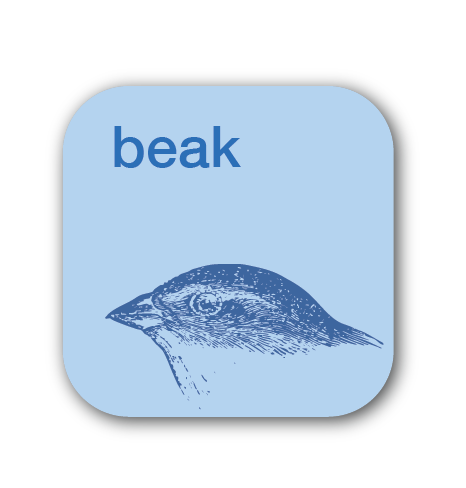

<div style="display: flex; align-items: top;">
     
     <h1 style="margin: 0;">BEAK</h3>
</div>
A Python toolkit for modeling protein evolutionary sequence data. <br>
<br>

## Motivation
Beak addresses several common challenges in modeling evolutionary sequence data in the context of experimental biophysics and biochemistry. The first is that compiling and aligning large sequence datasets is too intensive to run on a personal laptop, making it difficult to integrate these steps in exploratory data analysis. The second challenge is standardizing these steps, which can become laborious for experimentalists.

Beak works within a local notebook environment and is designed to streamline sequence database queries and multiple sequence alignment by offloading these processes to a local server and discretely managing handoff. Search and alignment parameters are cached for each project, making this information traceable and comparable between projects.

## Installation
Beak needs to first be installed before use. It requires `python>=3.8`. You can install Beak using:
```
git clone https://github.com/micah-olivas/beak.git && cd beak

pip install -e .
```

## Usage

Beak provides a workflow for remote protein sequence analysis with asynchronous job management. The main functionality is divided into three core areas:

### Remote Sequence Search
Search protein databases using mmseqs2 on a remote server with automatic job management.

### Multiple Sequence Alignment  
Perform Clustal Omega alignments on search results.

### Taxonomic Annotation
Annotate large sequence datasets using mmseqs2 taxonomy.

## Quick Start

### 1. Connect to Remote Server
```python
from beak.remote import sopen, authenticate

# Set up authentication (stores encrypted credentials)
authenticate("your_username")

# Connect to remote server
ssh = sopen()
```

### 2. Search Protein Databases
```python
from beak.remote import search, status, retrieve_results

# Start an asynchronous search (generates gibberish job ID)
sequence = "MLKRSSPSG..."
job = search(sequence, db="UniRef90")
print(f"Started job: {job['job_id']}")  # e.g., beak_zept_nuil_hydrieucks

# Use a custom job ID for easier tracking
job = search(sequence, db="UniRef90", job_id="my_protein_search")
print(f"Started job: {job['job_id']}")  # beak_my_protein_search

# Check job status
status(job['job_id'])

# Retrieve results when complete
results = retrieve_results(job['job_id'])
print(f"TSV results: {results['results']}")
print(f"FASTA results: {results['fasta']}")
```

### 3. Align Sequences
```python
from beak.remote import align

# Align the FASTA results from search (automatically reuses job_id)
alignment = align(results['fasta'])
print(f"Aligned sequences: {alignment['aligned_fasta']}")

# Use custom job_id for organized workflows
alignment = align(results['fasta'], job_id="my_alignment_job")
print(f"Aligned sequences: {alignment['aligned_fasta']}")

# Or reuse existing job_id from search for better integration
alignment = align(results['fasta'], job_id=job['job_id'])
print(f"Aligned sequences: {alignment['aligned_fasta']}")
```

### 4. Monitor All Jobs
```python
# Check status of all running jobs
status()

# Get detailed status for specific job
status("beak_my_custom_job", verbose=True)
```

## Detailed Usage

### Remote Search Workflow

The search function implements an asynchronous workflow that starts jobs and returns immediately:

```python
from beak.remote import search, status, retrieve_results

# 1. Start search (returns immediately)
job = search(
    query="MKLLVLSLSLVLVAPMAAQAAEITLVPSVKLQIGDRDNRGYGEWLGINPGDFSAEVTQNTLPIIQ",
    db="UniRef90",           # Database: UniRef90, UniRef50, UniRef100, uniprot_all
    job_id="my_protein_search",  # Custom job ID (optional)
    verbose=True             # Show detailed progress
)

# Returns: {"job_id": "beak_my_protein_search", "status": "running", "config": "config.json"}
# Without custom job_id, would return gibberish like: {"job_id": "beak_zept_nuil_hydrieucks", "status": "running", "config": "config.json"}

# 2. Monitor progress
status(job['job_id'])
# ✅ Search job 'beak_my_protein_search' is completed
# Use retrieve_results('beak_my_protein_search') to download results

# 3. Retrieve results
results = retrieve_results(job['job_id'])
# Returns: {
#   "results": "beak_results/beak_my_protein_search/search_results.tsv",    # Tab-separated results
#   "fasta": "beak_results/beak_my_protein_search/search_results.fasta",    # FASTA sequences  
#   "config": "beak_results/beak_my_protein_search/search_config.json"      # Search configuration
# }
```

### Multiple Sequence Alignment

The align function automatically cleans sequences and runs Clustal Omega:

```python
from beak.remote import align

# Align FASTA file or sequences
alignment = align(
    input_fasta="sequences.fasta",    # Local file path or FASTA content string
    output_fasta="aligned.fasta",     # Optional: custom output filename
    verbose=True,                     # Show detailed progress
    user_id="protein_alignment"       # Optional: custom job ID
)

# Returns: {
#   "aligned_fasta": "beak_results/beak_protein_alignment/aligned.fasta",
#   "input": "File: sequences.fasta", 
#   "job_id": "beak_protein_alignment"
# }
```

### Job Status Management

Track all your search and alignment jobs:

```python
from beak.remote import status

# List all jobs
all_jobs = status()
# 📋 Checking all beak jobs...
#   beak_my_protein_search (search): completed ✅
#   beak_protein_alignment (align): running 🔄

# Check specific job with details
job_info = status("beak_my_protein_search", verbose=True)
# Returns: {
#   "job_id": "beak_my_protein_search",
#   "job_type": "search",
#   "status": "completed",
#   "is_running": False,
#   "is_complete": True,
#   "remote_dir": "beak_tmp/beak_my_protein_search"
# }
```

### Interactive Session Mode

For Jupyter notebooks, use the interactive session:

```python
from beak.remote import connect_remote

# Connect with progress indicators
session = connect_remote("your_username")

# Use session methods
job = session.search_async("MLSRGKS...", db="UniRef90", user_id="my_search")
status_info = session.check_status(job['job_id'])
results = session.get_results(job['job_id'])
alignment = session.align_sequences(results['fasta'], job_id=job['job_id'], user_id="my_alignment")

# Clean up
session.disconnect()
```

## Complete Workflow Example

Here's a complete protein analysis workflow:

```python
from beak.remote import authenticate, search, status, retrieve_results, align

# 1. Set up authentication
authenticate("username")

# 2. Search for homologous sequences
sequence = "MKLLVLSLSLVLVAPMAAQAAEITLVPSVKLQIGDRDNRGYGEWLGINPGDFSAEVTQNTLPIIQ"
job = search(sequence, db="UniRef90", user_id="homolog_search")
print(f"🔍 Started search job: {job['job_id']}")

# 3. Wait for completion (or check later)
while True:
    job_status = status(job['job_id'])
    if job_status['status'] == 'completed':
        break
    elif job_status['status'] == 'failed':
        print("❌ Search failed")
        exit()
    print("⏳ Still running...")
    time.sleep(30)

# 4. Retrieve search results
results = retrieve_results(job['job_id'])
print(f"📊 Found sequences in: {results['fasta']}")

# 5. Align the sequences (automatically reuses same job_id)
alignment = align(results['fasta'], job_id=job['job_id'])
print(f"🧬 Aligned sequences saved to: {alignment['aligned_fasta']}")

# 6. Check all jobs status
status()
```

## Available Databases

- **UniRef90**: UniProt Reference Clusters (90% identity)
- **UniRef50**: UniProt Reference Clusters (50% identity)  
- **UniRef100**: UniProt Reference Clusters (100% identity)
- **uniprot_all**: Complete UniProt database
- **uniref50**: Alternative UniRef50 format

## Configuration Files

Each job creates configuration files for reproducibility:

```json
{
  "job_id": "beak_zept_nuil_hydrieucks",
  "timestamp": "2024-01-29T12:34:56",
  "query_sequence": "MKLLVL...",
  "database": "UniRef90",
  "database_path": "/srv/protein_sequence_databases/UniRef90",
  "mmseqs_command": "mmseqs search",
  "settings": {
    "sensitivity": 1,
    "sort_results": 1
  }
}
```

## Error Handling

Beak provides robust error handling and helpful error messages:

```python
# Handle search failures
job = search("invalid_sequence")
if job is None:
    print("Search failed to start")

# Check for failed jobs
job_status = status("job_id")
if job_status['status'] == 'failed':
    print(f"Job failed: {job_status['log_content']}")

# Handle alignment issues
alignment = align("empty_file.fasta")
if alignment is None:
    print("Alignment failed - check input sequences")
```

## Tips for Large-Scale Analysis

1. **Use asynchronous workflow**: Start multiple searches, then collect results
2. **Monitor job status**: Use `status()` to track progress without blocking
3. **Organized local storage**: Results are saved in structured directories under `beak_results/`
4. **Clean up**: Old job directories can be manually removed from `~/beak_tmp/` and `beak_results/`

## Troubleshooting

### Common Issues:

- **Authentication errors**: Re-run `authenticate("username")` 
- **SSH connection issues**: Check VPN and server access
- **Job not found**: Use `status()` to list all available jobs
- **Alignment failures**: Usually caused by empty sequences (automatically cleaned)
- **Long search times**: Large databases can take 10-30 minutes

### Debug Mode:
```python
# Use verbose mode for detailed output
job = search(sequence, verbose=True)
alignment = align(results['fasta'], verbose=True)
status("job_id", verbose=True)
```

