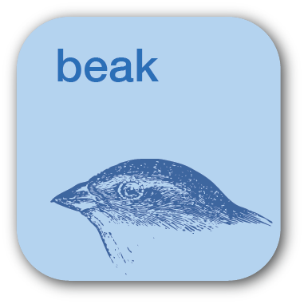

<div style="display: flex; align-items: top;">
     
     <h1 style="margin: 0;">BEAK</h1>
</div>

**B**iophysical and **E**volutionary **A**nalysis **K**it

A Python toolkit for **interpreting protein experiments in evolutionary and structural context**. BEAK is built for experimental biophysicists and biochemists who want to join their biochemical measurements to conservation, taxonomy, and structural features at the residue level — and ask questions of the combined data.

Remote compute (MMseqs2 searches, Clustal Omega alignments, HMMER scans over SSH) is the engine that makes the expensive parts tractable, but it's plumbing — the product is the joined data at a single protein's residues.

[](https://opensource.org/licenses/MIT)
[](https://www.python.org/downloads/)

---

## What BEAK is for

The central use case: one deeply-characterized protein understood in the context of its evolutionary homologs. You bring biochemical measurements (activity, stability, binding, etc.) for perturbations at many positions. BEAK surrounds each position with its evolutionary context (conservation, taxonomy, growth temperature) and structural context (pLDDT, secondary structure, burial, contacts), then gives you one table keyed on target-sequence position where you can filter, join, and plot.

## Local Analysis

<!-- Something about object structure here -->


## Remote Compute

Remote pipelines are the enabler: they produce the MSAs, taxonomies, and annotations that local analysis consumes. Jobs run asynchronously on your server; BEAK tracks them, pulls results when they're ready, and hands them to the interpretation layer.

### Homologs for your target
- **Sequence search** against UniRef, BFD, or any database you've prepared — via [MMseqs2](https://github.com/soedinglab/MMseqs2). Hits land as a FASTA file ready to align.
- **Pfam-based discovery** via UniProt REST + [HMMER](http://hmmer.org/) — scan a sequence for Pfam domains, fetch all UniProt proteins sharing them.

### Alignments and trees
- **Multiple sequence alignments** via [Clustal Omega](http://www.clustal.org/omega/), MAFFT, or MUSCLE — the MSA is the substrate every evolutionary feature is computed from.
- **Maximum likelihood phylogenetic trees** via [IQ-TREE](http://www.iqtree.org/).
- **Chained workflows** (search → filter → align → tree) as a single pipeline job.

### Taxonomy and annotations
- **MMseqs2 taxonomy** for LCA-based organism assignment when UniProt doesn't have it (BFD, metagenomic).
- **Growth-temperature annotation** (Enqvist dataset) joined by organism name — feeds comparative analyses downstream.

### Structures and embeddings
- **Structure discovery and download** via PDBe SIFTS + RCSB + [AlphaFold](https://alphafold.ebi.ac.uk/) — per-UniProt-ID, with best/all/N selection strategies.
- **Protein language model embeddings** via [ESM](https://github.com/facebookresearch/esm) and [ProGen](https://github.com/salesforce/progen).

### Job management
- Async submission with named jobs, local tracking of state (`~/.beak/jobs.json`).
- Status, logs, cancellation, and result retrieval all via the CLI or Python API.
- Every output comes back parseable into pandas — ready to join to your measurements.

---

## Quick Start

### Installation

```bash
git clone https://github.com/micah-olivas/beak.git
cd beak
pip install -e .
```

### Remote Server Setup

BEAK requires SSH access to a remote server with bioinformatics tools installed.

**1. Generate SSH key (if you don't have one):**

```bash
ssh-keygen -t ed25519 -C "your_email@example.com"
```

**2. Copy your public key to the remote server:**

```bash
ssh-copy-id username@your-server.edu
```

**3. Test your connection:**

```bash
ssh username@your-server.edu
```

BEAK will automatically detect your SSH key at `~/.ssh/id_ed25519` or `~/.ssh/id_rsa`. To use a custom key, specify `key_path` when initializing.

**Required tools on remote server:**
- [MMseqs2](https://github.com/soedinglab/MMseqs2) for sequence search and taxonomy
- [Clustal Omega](http://www.clustal.org/omega/) for alignment
- [IQ-TREE](http://www.iqtree.org/) for phylogenetics
- [HMMER](http://hmmer.org/) for Pfam domain annotation (optional, needed for `beak pfam`)

### Pfam Database Setup

The `beak pfam` command requires the Pfam-A HMM database on your remote server. BEAK provides a setup command that handles the download, decompression, and indexing for you.

**System requirements:**
- ~5 GB disk space (compressed download is ~1.5 GB, expands + press indices)
- [HMMER3](http://hmmer.org/) installed on the remote (`sudo apt install hmmer` or `conda install -c bioconda hmmer`)

**User-space install** (no special permissions needed):

```bash
beak setup pfam
```

This downloads Pfam-A to `~/beak_databases/pfam/` on the remote server.

**System-wide install** (shared across users, requires sudo on the remote):

```bash
beak setup pfam --system
```

This installs to `/srv/protein_sequence_databases/pfam/` with world-readable permissions, so all users on the server can access the same database.

**Custom path:**

```bash
beak setup pfam --path /data/shared/pfam
```

**Check status or update:**

```bash
beak setup pfam --status    # Check install location, age, and HMMER version
beak setup pfam --update    # Re-download the latest Pfam release
```

BEAK auto-detects the database by checking (in order): your config, `/srv/protein_sequence_databases/pfam/`, and `~/beak_databases/pfam/`. You can also set the path explicitly:

```bash
beak config set databases.pfam_path /your/custom/path
```

### Shared ESM Embeddings Service (optional)

The `beak embeddings` command runs ESM models in a Docker container on the remote. By default each beak user deploys their own copy under `~/beak_jobs/docker/`, which means a 3 GB image pull and a per-user running container. On shared servers this is wasteful.

To share a single service across all beak users:

1. **Admin setup (one time):** pick (or create) a shared Unix group that all beak users belong to, then create the service directory with group-write + setgid so new files inherit the group.
   ```bash
   # Create the group and add users (skip the first line if using an
   # existing group like `docker` or `users`)
   sudo groupadd beak_users
   sudo usermod -aG beak_users <username>   # repeat per user; users must log out/in

   sudo mkdir -p /srv/beak_docker
   sudo chgrp beak_users /srv/beak_docker
   sudo chmod 2775 /srv/beak_docker         # 2 = setgid (new files inherit group)
   ```

2. **Each user:** point beak at the shared path.
   ```bash
   beak config set docker.service_dir /srv/beak_docker
   ```

With this set, the first user to submit an embeddings job triggers the build; everyone after that sees the service already running and simply `docker compose exec`s into it. The compose project name is pinned to `beak` across users so all invocations target the same container regardless of working directory.

Users must also be members of the `docker` group on the remote to interact with the daemon.
```

Run `beak doctor` to verify your setup — it reports tool availability, database status, and database age.

---

## Usage Examples

### Simple Sequence Search

```python
from beak.remote import MMseqsSearch

# Initialize connection (auto-detects SSH key)
search = MMseqsSearch(
    host="your-server.edu",
    user="your_username"
)

# List available databases
search.list_databases()

# Submit a search job
job_id = search.submit(
    query_file="my_sequences.fasta",
    database="uniref90",
    job_name="my_search",
    e=0.001,
    threads=8
)

# Check status
search.status(job_id)

# Get results as a DataFrame
results = search.get_results(job_id)

# Extract hit sequences
result = search.get_results(job_id, parse=False, download_sequences=True)
hits_fasta = result['fasta']
```

### Automated Pipeline

```python
from beak.remote import Pipeline

# Create pipeline
pipe = Pipeline(
    host="your-server.edu",
    user="your_username"
)

# Define workflow
pipe.search("query.fasta", database="uniref90", e=0.001, threads=8) \
    .taxonomy(database="uniref90") \
    .align(threads=4) \
    .tree(bootstrap=1000)

# View pipeline
print(pipe)
# Output:
# Pipeline:
#   Input: query.fasta
#   Steps (4):
#     1. search (database=uniref90, e=0.001, threads=8)
#     2. taxonomy (database=uniref90)
#     3. align (threads=4)
#     4. tree (bootstrap=1000)

# Execute
job_id = pipe.execute(job_name="my_analysis")

# Monitor progress
pipe.print_detailed_status(job_id)
# Output:
# ============================================================
# Pipeline: my_analysis (abc12345)
# Status: RUNNING | Runtime: 0:05:23
# ============================================================
#   ✓ Step 1: search (database=uniref90, e=0.001, threads=8) [COMPLETED]
#     └─ hits: 164
#   ⟳ Step 2: taxonomy (database=uniref90) [RUNNING]
#   ○ Step 3: align (threads=4) [PENDING]
#   ○ Step 4: tree (bootstrap=1000) [PENDING]
# ============================================================

# Download results from specific steps
search_results = pipe.get_step_results(job_id, step_number=1)
alignment = pipe.get_step_results(job_id, step_number=3)
```

### Conditional Pipelines

```python
# Only align if we find between 10-1000 hits
pipe.search("query.fasta", database="uniref90", e=0.001) \
    .if_min_hits(10).then('taxonomy', database="uniref90") \
    .if_max_hits(1000).then('align') \
    .tree()

job_id = pipe.execute()
```

### Pfam Domain Annotation

```bash
# Scan a sequence for Pfam domains
beak pfam my_sequence.fasta

# Scan and fetch UniProt IDs for each domain found
beak pfam my_sequence.fasta --uniprot

# Include taxonomy info in UniProt results
beak pfam my_sequence.fasta --uniprot --taxonomy

# Include full lineage (domain to species)
beak pfam my_sequence.fasta --uniprot --lineage

# Skip the scan — look up a known Pfam ID directly
beak pfam --pfam PF00069 --uniprot --taxonomy
```

```python
from beak.remote import BeakSession

bk = BeakSession()

# Scan for Pfam domains
hits = bk.hmmer.scan("my_sequence.fasta")
for hit in hits:
    print(f"{hit['pfam_id']}  {hit['pfam_name']}  E={hit['i_evalue']:.1e}")

# Fetch UniProt proteins containing a domain
from beak.api import query_uniprot_by_pfam

df = query_uniprot_by_pfam("PF00069", taxonomy=True)
print(f"{len(df)} proteins with kinase domain")
print(df.head())
```

### Taxonomy Assignment

```python
from beak.remote import MMseqsTaxonomy

# Initialize
taxonomy = MMseqsTaxonomy(
    host="your-server.edu",
    user="your_username"
)

# Assign taxonomy with full lineages
job_id = taxonomy.submit(
    query_file="sequences.fasta",
    database="uniref90",
    tax_lineage=True
)

# Get taxonomic annotations
tax_results = taxonomy.get_results(job_id)
# Returns DataFrame with columns: query, taxid, rank, scientific_name, lineage
```

---

## Motivation

BEAK addresses common challenges in modeling evolutionary sequence relationships:

1. **Computational Resources**: Large-scale sequence searches and alignments are too intensive for personal laptops
2. **Workflow Integration**: Difficult to integrate remote computational steps into exploratory data analysis
3. **Reproducibility**: Parameters and workflows need to be traceable and comparable across projects
4. **Pipeline Complexity**: Chaining multiple tools requires manual scripting and file management

**Solution**: BEAK works within your local notebook environment while seamlessly offloading compute-intensive tasks to remote servers. All job parameters are automatically cached, and pipelines can be defined declaratively, making analyses traceable, reproducible, and easy to iterate.

---

## Requirements

- Python 3.8+
- SSH access to a remote server with bioinformatics tools installed
- Dependencies: `fabric`, `pandas`, `biopython`, `paramiko`

---

## Citation

If you use BEAK in your research, please cite:

```
[Citation information coming soon]
```

---

## License

MIT License - see [LICENSE](LICENSE) file for details

---

## Contributing

Contributions welcome! Please open an issue or submit a pull request.

---

## Contact

micah5051olivas@gmail.com
