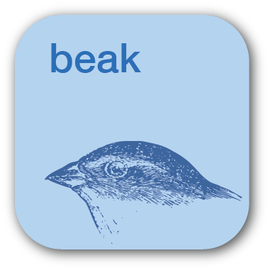

<div style="display: flex; align-items: top;">
     
     <h1 style="margin: 0;">BEAK</h1>
</div>

**B**iophysical and **E**volutionary **A**nalysis **K**it

A Python toolkit for interpreting protein perturbation experiments in the context of sequence, structure, and environment.

[](https://opensource.org/licenses/MIT)
[](https://www.python.org/downloads/)

---

## Overview

BEAK assembles a target-centric view of one protein: biochemical measurements (activity, stability, binding) joined to conservation, taxonomy, growth temperature, and structural features (pLDDT, secondary structure, burial, contacts) at every residue, keyed on target-sequence position. The result is a single table for filtering, joining, and plotting.

The expensive parts (MMseqs2 searches, Clustal Omega alignments, HMMER scans, ESM embeddings) run remotely over SSH. BEAK submits those jobs, tracks them locally, and pulls results back into the interpretation layer. That remote compute is infrastructure; the product is the joined data at a single protein's residues.

Those steps run through one canonical path. Each uses a fixed tool and a small set of named, benchmarked presets rather than hand-tuned flags, so analyses come out standardized, reproducible, and comparable by default. The parameters that produced each layer are recorded in the project manifest. See [Standardization and reproducibility](#standardization-and-reproducibility).

## Standardization and reproducibility

BEAK turns the routine, easy-to-get-wrong steps of a homology workflow into fixed, inspectable operations.

- **Fixed tool per step.** Search uses MMseqs2, alignment uses Clustal Omega, MAFFT, or MUSCLE, domain scans use HMMER, and embeddings use ESM. Each step has one canonical tool rather than a per-analysis choice.
- **Named presets.** `beak search --preset {default,close,broad,twilight}` selects a benchmarked bundle of sensitivity, E-value, coverage, and iteration count. ROC1 estimates and literature citations are recorded in the code, so `broad` produces the same search every time.
- **Single config.** Host, user, key, remote job dir, thread cap, and shared Docker service read from `~/.beak/config.toml`. A lab points every user at one server and every job inherits the same defaults.
- **Manifest provenance.** `beak.project.toml` records the remote `job_id` and `last_updated` for every layer, so each derived artefact traces back to the search, alignment, or embedding that produced it.
- **Reuse and dry-run.** `--reuse` returns an existing job when its inputs (file contents and parameters) match, instead of launching a duplicate. `--dry-run` prints the submission plan without spending compute.
- **Target-centric coordinates.** Every layer keys to the target's native residue numbering, so conservation, structure, and comparative scores from independently built sets line up directly.

Together these make an analysis reproducible from its recorded inputs, self-documenting through the manifest, and comparable across proteins, collaborators, and time.

## Installation

BEAK develops with [uv](https://docs.astral.sh/uv/), which provisions Python 3.11, manages the project venv, and installs from a committed lockfile for reproducible environments:

```bash
git clone https://github.com/micah-olivas/beak.git
cd beak
uv sync --extra dev         # creates .venv/ and installs beak editable; drop --extra dev for runtime-only
uv run beak --help          # run any command; uv resolves the project venv automatically
```

`uv run <cmd>` needs no activation. If you prefer, `source .venv/bin/activate` once and then call `beak` directly.

Or install with pip into an environment you manage yourself:

```bash
pip install -e ".[dev]"     # drop [dev] for a runtime-only install
```

### Requirements

- Python 3.8+ (uv installs and pins 3.11 automatically; pip users supply their own interpreter)
- SSH access to a remote server with bioinformatics tools installed (for remote steps only; analysis, import, and export work offline)
- Core dependencies (`pandas`, `biopython`, `fabric`, `click`, `rich`, `textual`, `torch`, ...) install automatically

## Remote Setup

Point BEAK at your server, then verify the connection:

```bash
beak config init     # interactive: host, user, SSH key, remote job dir → ~/.beak/config.toml
beak doctor          # report reachable tools, databases, and disk usage on the remote
```

BEAK auto-detects an SSH key at `~/.ssh/id_ed25519` or `~/.ssh/id_rsa`. If your lab already runs a shared BEAK server, `beak config init` + `beak doctor` is all you need.

Tools expected on the remote:

| Tool                                                    | Used by                                  |
| ------------------------------------------------------- | ---------------------------------------- |
| [MMseqs2](https://github.com/soedinglab/MMseqs2)        | sequence search, LCA taxonomy            |
| [Clustal Omega](http://www.clustal.org/omega/) / MAFFT / MUSCLE | multiple sequence alignment      |
| [IQ-TREE](http://www.iqtree.org/)                       | phylogenetic trees                       |
| [HMMER3](http://hmmer.org/)                             | Pfam domain scans (`beak pfam`)          |

### Search databases

MMseqs2 searches (`beak search --db <alias>`) resolve a short alias to a database on the remote. Which of these are actually present depends on the server — `beak doctor` reports availability and disk usage, and `MMseqsSearch(...).list_databases()` lists them programmatically.

| Alias         | Database        | Contents                                             | Taxonomy |
| ------------- | --------------- | ---------------------------------------------------- | -------- |
| `uniref90`    | UniRef90        | UniProt clustered at 90% identity (default choice)   | ✓        |
| `uniref50`    | UniRef50        | UniProt clustered at 50% identity (broader, smaller) | ✓        |
| `uniref100`   | UniRef100       | UniProt clustered at 100% identity                   | ✓        |
| `uniprotkb`   | UniProtKB       | Full UniProt (Swiss-Prot + TrEMBL)                   | ✓        |
| `swissprot`   | Swiss-Prot      | Reviewed, manually curated proteins                  | ✓        |
| `trembl`      | TrEMBL          | Unreviewed, automatically annotated proteins         | ✓        |
| `bfd`         | BFD             | Big Fantastic Database — metagenomic, remote homologs | —        |
| `gtdb`        | GTDB            | Genome Taxonomy Database — bacterial/archaeal genomes | —        |
| `pdb_seqres`  | PDB seqres      | Sequences of PDB structure entries                   | —        |
| `nt_rna`      | nt (RNA)        | NCBI nucleotide, RNA subset                          | —        |
| `rfam`        | Rfam            | RNA family reference sequences                       | —        |
| `rnacentral`  | RNAcentral      | Non-coding RNA sequences                             | —        |

The **Taxonomy** column marks databases usable with `beak taxonomy --db <alias>` for MMseqs2 LCA assignment — only the UniProt-derived protein databases carry the taxonomy annotations LCA needs. Any alias can also be a full remote path to a database BEAK doesn't know about.

Two optional remote setups:

```bash
beak setup pfam              # download + index Pfam-A HMM DB (~5 GB) for `beak pfam`
beak setup pfam --system     # shared, world-readable install (needs sudo on the remote)
```

ESM embeddings run in a Docker container on the remote. Each user deploys their own by default; to share one service across a lab, point everyone at a common directory with `beak config set docker.service_dir /srv/beak_docker` (users must be in the `docker` group).

## Package Structure

```
src/beak/
├── cli/            # Click + Rich CLI, one module per command group
├── project/        # BeakProject: the on-disk, target-centric analysis hub
├── remote/         # Fabric SSH job managers (search, align, embeddings,
│                   #   taxonomy, hmmer, pipeline) + BeakSession
├── api/            # REST clients (UniProt, PDBe SIFTS, AlphaFold)
├── alignments/     # alignment cache (FASTA→npz), conservation, PSSM formatting
├── analysis/       # comparative PSSMs (group / differential)
├── structures/     # per-residue pLDDT/SASA/contacts/SS, alignment↔PDB mapping
├── viz/            # PSSM logos, ChimeraX export
├── tui/            # Textual TUI (browse projects, layers, alignments, taxonomy)
├── embeddings.py   # embedding loaders + PCA cache
├── temperature.py  # organism → growth-temperature annotation (Enqvist dataset)
├── sequence.py     # FASTA parsing, sequence properties
├── config.py       # ~/.config/beak/config.toml read/write
└── datasets/       # auto-downloaded reference data
```

## Usage

### Projects

A project is a target-centric analysis hub on disk at `~/.beak/projects/<name>/`. It anchors on one protein sequence and accretes layers (homolog sets, taxonomy, structure, conservation), each keyed back to the target's residue positions.

```bash
beak project init my_kinase --uniprot P00533     # from a UniProt accession
beak project init my_kinase --sequence target.fasta   # or a local FASTA
beak project list                                  # all projects, with status + size
beak project status my_kinase                      # which layers are populated / stale
beak ui                                            # browse and build projects in the TUI
```

`beak ui` opens the Textual interface, where most project work happens: adding homolog sets, inspecting alignments and taxonomy, running comparative analyses, and submitting remote jobs.

### Remote building blocks

`BeakSession` is the recommended entry point for scripting remote jobs: one SSH connection fanned out to per-job-type managers, all reading defaults from `~/.beak/config.toml`.

```python
from beak.remote import BeakSession

bk = BeakSession()                                 # or BeakSession(host=..., user=...)

job = bk.search.submit("query.fasta", database="uniref90", e=0.001, threads=8)
bk.search.wait(job)
hits = bk.search.get_results(job)                  # pandas DataFrame

# Pfam domain scan (synchronous)
for hit in bk.hmmer.scan("query.fasta"):
    print(hit["pfam_id"], hit["pfam_name"], hit["i_evalue"])
```

Individual managers (`MMseqsSearch`, `MMseqsTaxonomy`, `ClustalAlign`, `ESMEmbeddings`, `HmmerScan`, `Pipeline`) are also importable directly from `beak.remote`.

### Pipelines

Chain search → taxonomy → align → tree into a single remote job:

```python
from beak.remote import Pipeline

pipe = Pipeline(host="your-server.edu", user="your_username")
pipe.search("query.fasta", database="uniref90", e=0.001) \
    .taxonomy(database="uniref90") \
    .align(threads=4) \
    .tree(bootstrap=1000)

job_id = pipe.execute(job_name="my_analysis")
pipe.print_detailed_status(job_id)                 # per-step progress
alignment = pipe.get_step_results(job_id, step_number=3)
```

Steps can be made conditional on hit counts:

```python
pipe.search("query.fasta", database="uniref90") \
    .if_min_hits(10).then("taxonomy", database="uniref90") \
    .if_max_hits(1000).then("align") \
    .tree()
```

### Command-line jobs

Every remote step is also a top-level command. Jobs run asynchronously; state is tracked in `~/.beak/jobs.json`.

```bash
beak search query.fasta --db uniref90 --preset broad   # submit a search
beak jobs                                               # list jobs, auto-refresh
beak status <job_id> --watch                            # follow one job
beak log <job_id> --follow                              # tail its remote log
beak results <job_id> --parse                           # pull results as a DataFrame

beak pfam query.fasta --uniprot --taxonomy              # scan domains, fetch UniProt hits
beak structures P00533 --source alphafold               # download structures
beak features model.cif --format parquet                # per-residue structural features
```

## Agentic workflows

These properties carry over when an agent drives BEAK rather than a person. An LLM agent operating on a BEAK project reads the same `~/.beak/config.toml` and the same project manifest a human does. Agent-launched jobs inherit the same server, tools, thread caps, and presets, so work stays consistent across sessions and between agents and people rather than each run reinventing parameters.

Every agent-relevant command speaks JSON and blocks cleanly:

```bash
beak doctor --json                                   # {ok, tools, databases, disk, load}; gate on .ok
beak search query.fasta --db uniref90 --preset broad --json --wait --reuse
# -> {"job_id": "a1b2c3d4", "status": "COMPLETED"}   # exit 0 if COMPLETED, nonzero on failure
beak results a1b2c3d4 --json                         # {results_path: ...}
```

`--wait` blocks to a terminal state and sets the exit code, so an agent branches on `$?` instead of scraping tables. `--reuse` keeps a retried step from launching a duplicate of an expensive search. `--dry-run` previews a plan offline. `beak doctor --json` reports server load so an agent throttles itself on shared compute. The full contract, covering the machine-mode loop, job-state surfaces, exit codes, and shared-server etiquette, is in [AGENTS.md](AGENTS.md).

## Citation

If you use BEAK in your research, please cite:

```
[Citation information coming soon]
```

## License

MIT License. See [LICENSE](LICENSE).

## Contributing

Contributions welcome. Please open an issue or submit a pull request.
